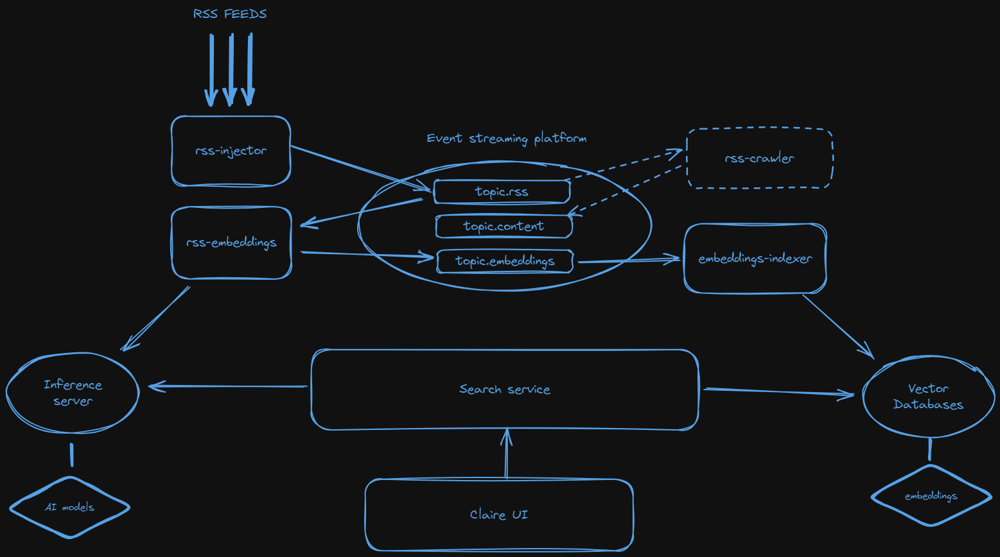

# clAIre

## Project Goal

The goal of the clAIre project is to provide users with an innovative way to interact with their RSS feeds using artificial intelligence. With clAIre, you will be able to have conversations with your RSS feed, making it easier to stay updated with the latest news and information.

## Architecture



## Features

- AI-powered interaction with RSS feeds
- Easy-to-use interface
- Real-time updates and notifications

## Getting Started

To get started with clAIre, follow the installation instructions and setup guide provided in the repository.

## Requirements

- JDK >= 21.0.5
- Docker >= 27.4.0
- Docker compose >= 2.31.0

### Ollama

[Ollama](https://ollama.com/) is a server that allows you to run LLMs locally on your machine. There are two options depending on your setup: local installation (recommended) or using Docker.

In addition to installing Ollama, you need to download [Nomic](https://ollama.com/library/nomic-embed-text), A high-performing open embedding model with a large token context window that can run on modest configurations.

<details>
    <summary><b>Local Installation (recommended)</b></summary>

This installation will allow Ollama to [take advantage of the GPU](https://github.com/ollama/ollama/blob/main/docs/gpu.md) on your machine. Follow the instructions at [https://ollama.com/download](https://ollama.com/download).

Once installed and running, download the model with `ollama pull nomic-embed-text:latest`.

To chat with the model, run `ollama run nomic-embed-text:latest` and say something, for example, "Hello, how are you?"

</details>

<details>
    <summary><b>Installation with Docker</b></summary>

If local installation is not possible, run Ollama by executing the following command:

```
docker compose up ollama
```

Once running, load the model with

```
docker exec -it ollama ollama pull nomic-embed-text:latest
```

</details>

### Getting github dependencies

Run the following commands:

```
git clone git@github.com:staillebois/rss-injector.git ../rss-injector
git clone git@github.com:staillebois/rss-embeddings.git ../rss-embeddings
git clone git@github.com:staillebois/es-indexer.git ../es-indexer
```

Build dependencies:

```
../rss-injector/mvnw -f ../rss-injector/pom.xml package
../rss-embeddings/gradlew -p ../rss-embeddings build
```

### Configuration

Update the environment variable `RSS_FEEDS` inside the `docker-compose.yml` file by adding the list of your favorites RSS feeds

### Run the platform

You just have to run the following command:

```
docker compose up -d
```

## Contributing

We welcome contributions from the community. Please read our contributing guidelines to learn how you can help improve clAIre.

## License

This project is licensed under the MIT License. See the LICENSE file for more details.